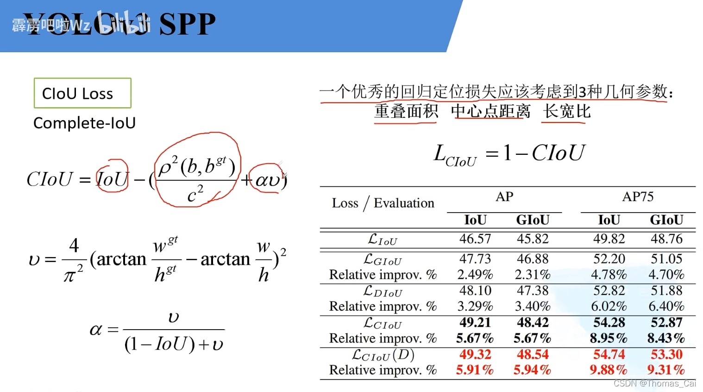

**IOU**：一般的iou，两个框的交集除以并集

**GIOU**：

$$GIOU = iou - ((AC-U)/AC)$$

其中， AC为两个框的外接矩形的面积，U为两个框的并集的面积
缺点：
1. 当两个框并列时，退化为IOU计算公式；
2. 两个框，小框在大框中时，无法衡量两个框的位置关系，**基于这一点提出DIOU**；

$$DIOU：= iou - (d^2 / c^2)$$

其中d为两个框中心点的距离，c为两个框外接矩形的对角线的距离

$$CIOU：= iou - (d^2 / c^2 + av)$$

考虑到了距离和框的宽高

  
参考：https://blog.csdn.net/ThomasCai001/article/details/123593690?csdn_share_tail=%7B%22type%22%3A%22blog%22%2C%22rType%22%3A%22article%22%2C%22rId%22%3A%22123593690%22%2C%22source%22%3A%22ThomasCai001%22%7D